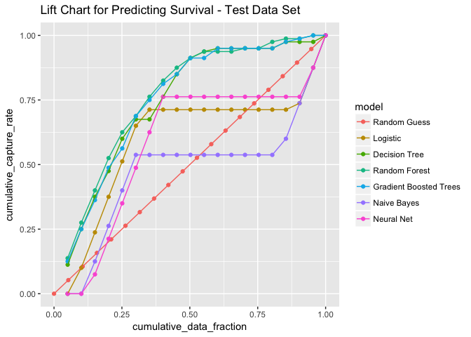
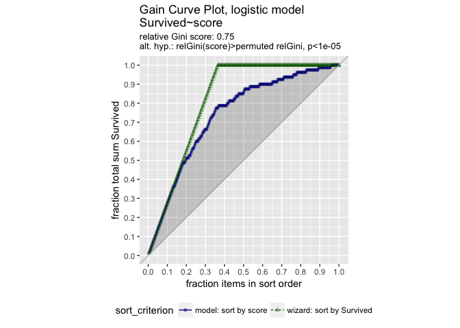
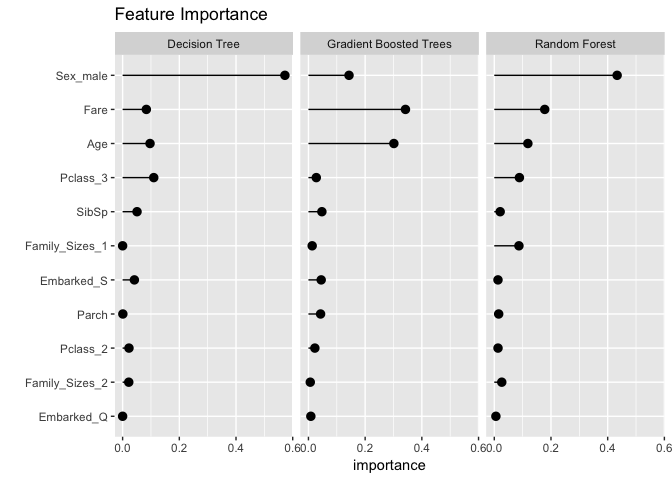

Overview
========

You can use `sparklyr` to fit a wide variety of machine learning algorithms in Apache Spark. This analysis compares the performance of six classification models in Apache Spark on the [Titanic](https://www.kaggle.com/c/titanic) data set.

Compare the following 6 models:

-   Random forest - `ml_random_forest`
-   Decision tree - `ml_decision_tree`
-   Gradient boosted trees - `ml_gradient_boosted_trees`
-   Logistic regression - `ml_logistic_regression`
-   Multilayer perceptron (neural net) - `ml_multilayer_perceptron`
-   Naive Bayes - `ml_naive_bayes`

Load the data
=============

Parquet is a column based data format that is also compressed. It is a format often used with Spark. Load the Titanic Parquet data into a local spark cluster.

``` r
# Connect to local spark cluster and load data
sc <- spark_connect(master = "local")
spark_read_parquet(sc, name = "titanic", path = "datainputs/titanic-parquet")
```

    ## # Source:   table<titanic> [?? x 12]
    ## # Database: spark_connection
    ##    PassengerId Survived Pclass
    ##          <int>    <int>  <int>
    ##  1           1        0      3
    ##  2           2        1      1
    ##  3           3        1      3
    ##  4           4        1      1
    ##  5           5        0      3
    ##  6           6        0      3
    ##  7           7        0      1
    ##  8           8        0      3
    ##  9           9        1      3
    ## 10          10        1      2
    ## # ... with more rows, and 9 more variables: Name <chr>, Sex <chr>,
    ## #   Age <dbl>, SibSp <int>, Parch <int>, Ticket <chr>, Fare <dbl>,
    ## #   Cabin <chr>, Embarked <chr>

``` r
titanic_tbl <- tbl(sc, "titanic")
```

------------------------------------------------------------------------

Tidy the data
=============

Tidy the data in preparation for model fitting. `sparklyr` uses `dplyr` syntax when connecting to the Spark SQL API and specific functions for connecting to the Spark ML API.

Spark SQL transforms
--------------------

Use feature transforms with Spark SQL. Create new features and modify existing features with `dplyr` syntax.

Create a new remote table with handle `titanic2_tbl` from `titanic_tbl` with additional (or altered) colums:

1.  Family\_Size - Family is the sum of spouse/siblings (SibSp), parents (Parch), plus themself
2.  Pclass - Format passenger class (Pclass) as character not numeric
3.  Embarked - Remove a small number of missing records
4.  Age - Impute missing age with average age

``` r
# Transform features with Spark SQL API
titanic2_tbl <- titanic_tbl %>% 
  mutate(Family_Size = SibSp + Parch + 1L) %>%  
  mutate(Pclass = as.character(Pclass)) %>%
  filter(!is.na(Embarked)) %>%
  mutate(Age = if_else(is.na(Age), mean(Age), Age)) %>%
  compute()
```

Spark ML transforms
-------------------

Use feature transforms with Spark ML. Use `ft_bucketizer` to bucket family sizes into groups.

``` r
# Transform family size with Spark ML API
titanic_final_tbl <- titanic2_tbl %>%
  mutate(Family_Size = as.numeric(Family_size)) %>%
  sdf_mutate(
    Family_Sizes = ft_bucketizer(Family_Size, splits = c(1,2,5,12))
    ) %>%
  mutate(Family_Sizes = as.character(as.integer(Family_Sizes))) %>%
  compute()
```

> Tip: You can use magrittr pipes to chain dplyr commands with sparklyr commands. For example, `mutate` is a dplyr command that accesses the Spark SQL API whereas `sdf_mutate` is a sparklyr command that accesses the Spark ML API.

Train-validation split
----------------------

Randomly partition the data into train and test sets.

``` r
# Partition the data.
# The as.numeric() conversions are because Integer and Doubles are not interchangable in Java/Scala
partition <- titanic_final_tbl %>% 
  mutate(Survived = as.numeric(Survived), SibSp = as.numeric(SibSp), Parch = as.numeric(Parch)) %>%
  select(Survived, Pclass, Sex, Age, SibSp, Parch, Fare, Embarked, Family_Sizes) %>%
  sdf_partition(train = 0.75, test = 0.25, seed = 8585)

# Create table references
train_tbl <- partition$train
test_tbl <- partition$test
```

> Tip: Use `sdf_partition` to create training and testing splits.

------------------------------------------------------------------------

Train the models
================

Train multiple machine learning algorithms on the training data. Score the test data with the fitted models.

Logistic regression
-------------------

Logistic regression is one of the most common classifiers. Train the logistic regression and examine the predictors.

``` r
# Model survival as a function of several predictors
ml_formula <- formula(Survived ~ Pclass + Sex + Age + SibSp + Parch + Fare + Embarked + Family_Sizes)

# Train a logistic regression model
(ml_log <- ml_logistic_regression(train_tbl, ml_formula))
```

    ## * No rows dropped by 'na.omit' call

    ## Call: Survived ~ Pclass_2 + Pclass_3 + Sex_male + Age + SibSp + Parch + Fare + Embarked_Q + Embarked_S + Family_Sizes_1 + Family_Sizes_2
    ## 
    ## Coefficients:
    ##    (Intercept)       Pclass_2       Pclass_3       Sex_male            Age 
    ##   3.7701596246  -1.0012118315  -2.0776479561  -2.6740713977  -0.0412193174 
    ##          SibSp          Parch           Fare     Embarked_Q     Embarked_S 
    ##  -0.0560113619   0.1628399176   0.0002930454   0.3638779011  -0.1011644722 
    ## Family_Sizes_1 Family_Sizes_2 
    ##   0.1417538627  -1.8267676504

Other ML algorithms
-------------------

Run the same formula using the other machine learning algorithms. Notice that training times vary greatly between methods.

``` r
## Decision Tree
ml_dt <- ml_decision_tree(train_tbl, ml_formula)
```

    ## * No rows dropped by 'na.omit' call

``` r
## Random Forest
ml_rf <- ml_random_forest(train_tbl, ml_formula)
```

    ## * No rows dropped by 'na.omit' call

``` r
## Gradient Boosted Trees
ml_gbt <- ml_gradient_boosted_trees(train_tbl, ml_formula)
```

    ## * No rows dropped by 'na.omit' call

``` r
## Naive Bayes
ml_nb <- ml_naive_bayes(train_tbl, ml_formula)
```

    ## * No rows dropped by 'na.omit' call

``` r
## Neural Network
ml_nn <- ml_multilayer_perceptron(train_tbl, ml_formula, layers = c(11,15,2))
```

    ## * No rows dropped by 'na.omit' call

Validation data
---------------

Score the test data with the trained models.

``` r
# Bundle the modelss into a single list object
ml_models <- list(
  "Logistic" = ml_log,
  "Decision Tree" = ml_dt,
  "Random Forest" = ml_rf,
  "Gradient Boosted Trees" = ml_gbt,
  "Naive Bayes" = ml_nb,
  "Neural Net" = ml_nn
)

# Create a function for scoring
score_test_data <- function(model, data=test_tbl){
  pred <- sdf_predict(model, data)
  select(pred, Survived, prediction)
}

# Score all the models
ml_score <- lapply(ml_models, score_test_data)
```

------------------------------------------------------------------------

Compare results
===============

Compare the model results. Examine performance metrics: lift, AUC, and accuracy. Also examine feature importance to see what features are most predictive of survival.

Model lift
----------

Lift compares how well the model predicts survival compared to random guessing. Use the function below to estimate model lift for each scored decile in the test data. The lift chart suggests that the tree models (random forest, gradient boosted trees, or the decision tree) will provide the best prediction.

For more information see the discussion on the *gain curve* in the section "Evaluating the Model" of [this post](http://www.win-vector.com/blog/2015/07/working-with-sessionized-data-1-evaluating-hazard-models/).

``` r
nbins = 20

# Lift_function
calculate_lift = function(scored_data, numbins=nbins) {
 scored_data %>%
    mutate(bin = ntile(desc(prediction), numbins)) %>% 
    group_by(bin) %>% 
    summarize(ncaptured = sum(Survived),
              ndata = n())  %>% 
    arrange(bin) %>% 
    mutate(cumulative_data_fraction=cumsum(ndata)/sum(ndata),
           cumulative_capture_rate=cumsum(ncaptured)/sum(ncaptured))  %>% 
    select(cumulative_data_fraction, cumulative_capture_rate) %>% 
    collect() %>% 
    as.data.frame()
}

# Initialize results
ml_gains <- data.frame(cumulative_data_fraction = seq(0,1,len=nbins),
                       cumulative_capture_rate=seq(0,1,len=nbins),
                       model="Random Guess")

# Calculate lift
for(i in names(ml_score)){
  ml_gains <- ml_score[[i]] %>%
    calculate_lift %>%
    mutate(model = i) %>%
    rbind(ml_gains, .)
}

# Plot results
# Note that logistic regression, Naive Bayes and Neural net are all returning HARD classification, 
# NOT probability scores. The probabilities are there for (at least) logistic, but not easily 
# manipulable through sparklyr (this will improve with https://github.com/rstudio/sparklyr/issues/648 ).
ggplot(ml_gains, aes(x = cumulative_data_fraction, y = cumulative_capture_rate, colour = model)) +
  geom_point() + geom_line() +
  ggtitle("Lift Chart for Predicting Survival - Test Data Set") 
```



> Tip: `dplyr` and `sparklyr` both support windows functions, including `ntiles` and `cumsum`.

Suppose we want the lift curve for logistic regression, based on *probabilities*, not hard class prediction. One way to do this is to bring a sample of the data over to R and plot the lift (we will used WVPlots::GainCurvePlot).

``` r
# get the probabilities from sdf_predict()
ml_logistic <- sdf_predict(ml_models[["Logistic"]], test_tbl) %>% 
  select(Survived, prediction, probability)

# Survived is true outcome; prediction is the hard class prediction
# probability is a list of Prob(class 0), Prob(class 1)
ml_logistic
```

    ## # Source:   lazy query [?? x 3]
    ## # Database: spark_connection
    ##    Survived prediction probability
    ##       <dbl>      <dbl>      <list>
    ##  1        0          1   <dbl [2]>
    ##  2        0          0   <dbl [2]>
    ##  3        0          0   <dbl [2]>
    ##  4        0          0   <dbl [2]>
    ##  5        0          0   <dbl [2]>
    ##  6        0          0   <dbl [2]>
    ##  7        0          0   <dbl [2]>
    ##  8        0          0   <dbl [2]>
    ##  9        0          0   <dbl [2]>
    ## 10        0          0   <dbl [2]>
    ## # ... with more rows

``` r
# Let's take a "sample" of ml_logistic to bring over. This data happens to
# be small, so we'll take the whole thing, but in real-world situations you
# would of course use a fraction < 1
fraction = 1
ml_logistic_sample = sdf_sample(ml_logistic, fraction, replacement=FALSE) %>%
  collect()  # collect() brings the data to local R

# add a column -- the probability of class 1 (survived)
ml_logistic_sample$score = vapply(ml_logistic_sample$probability, 
                                  function(ri) { ri[[2]] }, numeric(1))

WVPlots::GainCurvePlot(ml_logistic_sample, 
                             "score", "Survived", 
                             "Gain Curve Plot, logistic model")
```



``` r
WVPlots::ROCPlot(ml_logistic_sample, 
                             "score", "Survived", 1,
                             "ROC Plot, logistic model")
```


``` r
# if on dev version of WVPlots
rocFrame <- WVPlots::graphROC(ml_logistic_sample$score, 
                              ml_logistic_sample$Survived==1)
plot_ly(rocFrame$pointGraph, x = ~FalsePositiveRate, y = ~TruePositiveRate, 
        type='scatter', mode='markers', hoverinfo= 'text', 
        text= ~ paste('threshold:', model, 
                      '</br>FalsePositiveRate:', FalsePositiveRate,
                      '</br>TruePositiveRate:', TruePositiveRate))
```


``` r
# compare this graph (not the previous ones) to balanced accuracy
# http://www.win-vector.com/blog/2016/07/a-budget-of-classifier-evaluation-measures/
ml_logistic_sample <- ml_logistic_sample %>% mutate(qscore = ifelse(score>0.5, 1.0, 0.0))
WVPlots::ROCPlot(ml_logistic_sample, 
                             "qscore", "Survived", 1,
                             "ROC Plot, logistic decision")
```


``` r
# As long as we have it, let's call caret on the local score data.
tab = table(pred = as.character(ml_logistic_sample$prediction==1), 
            lbsurvived = as.character(ml_logistic_sample$Survived==1))
print(tab)
```

    ##        lbsurvived
    ## pred    FALSE TRUE
    ##   FALSE   125   23
    ##   TRUE     14   57

``` r
# this only works if the package e1071 is loaded
caret::confusionMatrix(tab,
            positive= 'TRUE')
```

    ## Confusion Matrix and Statistics
    ## 
    ##        lbsurvived
    ## pred    FALSE TRUE
    ##   FALSE   125   23
    ##   TRUE     14   57
    ##                                           
    ##                Accuracy : 0.8311          
    ##                  95% CI : (0.7747, 0.8782)
    ##     No Information Rate : 0.6347          
    ##     P-Value [Acc > NIR] : 1.339e-10       
    ##                                           
    ##                   Kappa : 0.6267          
    ##  Mcnemar's Test P-Value : 0.1884          
    ##                                           
    ##             Sensitivity : 0.7125          
    ##             Specificity : 0.8993          
    ##          Pos Pred Value : 0.8028          
    ##          Neg Pred Value : 0.8446          
    ##              Prevalence : 0.3653          
    ##          Detection Rate : 0.2603          
    ##    Detection Prevalence : 0.3242          
    ##       Balanced Accuracy : 0.8059          
    ##                                           
    ##        'Positive' Class : TRUE            
    ## 

AUC and accuracy
----------------

Though ROC curves are not available, Spark ML does have support for Area Under the ROC curve. This metric captures performance for specific cut-off values. The higher the AUC the better.

``` r
# Function for calculating accuracy
calc_accuracy <- function(data, cutpoint = 0.5){
  data %>% 
    mutate(prediction = if_else(prediction > cutpoint, 1.0, 0.0)) %>%
    ml_classification_eval("prediction", "Survived", "accuracy")
}

# Calculate AUC and accuracy
perf_metrics <- data.frame(
  model = names(ml_score),
  AUC = sapply(ml_score, ml_binary_classification_eval, "Survived", "prediction"),
  Accuracy = sapply(ml_score, calc_accuracy),
  row.names = NULL, stringsAsFactors = FALSE)

# Plot results
gather(perf_metrics, metric, value, AUC, Accuracy) %>%
  ggplot(aes(reorder(model, value, FUN=mean), value)) + 
  geom_pointrange(aes(ymin=0, ymax=value)) + 
  facet_wrap(~metric, ncol=1, scale="free_x") + 
  xlab("Model") +
  ylab("Score") +
  ggtitle("Performance Metrics (Larger is better)")  +
  coord_flip(ylim=c(0,1))
```


Feature importance
------------------

It is also interesting to compare the features that were identified by each model as being important predictors for survival. The logistic regression and tree models implement feature importance metrics. Sex, fare, and age are some of the most important features.

``` r
# Initialize results
feature_importance <- data.frame()

# Calculate feature importance
for(i in c("Decision Tree", "Random Forest", "Gradient Boosted Trees")){
  feature_importance <- ml_tree_feature_importance(sc, ml_models[[i]]) %>%
    mutate(Model = i) %>%
    mutate(importance = as.numeric(levels(importance))[importance]) %>%
    mutate(feature = as.character(feature)) %>%
    rbind(feature_importance, .)
}

# Plot results
feature_importance %>%
  ggplot(aes(reorder(feature, importance), importance)) + 
  facet_wrap(~Model) +
  geom_pointrange(aes(ymin=0, ymax=importance)) + 
  coord_flip() +
  xlab("") +
  ggtitle("Feature Importance")
```



------------------------------------------------------------------------

Discuss
=======

You can use `sparklyr` to run a variety of classifiers in Apache Spark. For the Titanic data, the best performing models were tree based models. Gradient boosted trees was one of the best models, but also had a much longer average run time than the other models. Random forests and decision trees both had good performance and fast run times.

While these models were run on a tiny data set in a local spark cluster, these methods will scale for analysis on data in a distributed Apache Spark cluster.
